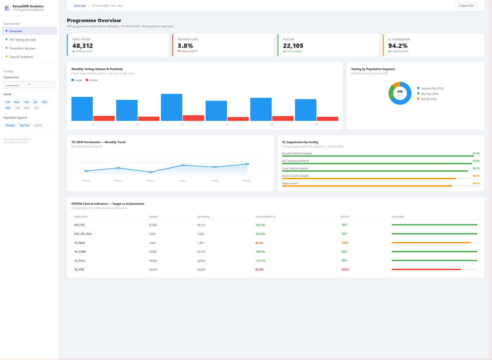

# KenyaEMR Dashboard

    

An interactive, multi-page analytics dashboard built with **Streamlit** for visualizing HIV program performance indicators from the **KenyaEMR** electronic health records system.

---

## Overview

The **KenyaEMR Dashboard** provides health program managers and data analysts with real-time, filterable insights into HIV service delivery across four key program areas. Data is sourced directly from the `kenyaemr_etl` MySQL database through parameterized SQL queries, then transformed and visualized using Pandas and Plotly Express.

---

## Screenshot



---

## Features

- **Overview Page** — High-level summary of all program KPIs at a glance
- **HIV Testing Services (HTS)** — Monthly testing volumes, positivity rates, and disaggregated results by financial year
- **Prevention Services** — Key population (KP) prevention metrics and GBV tracking with downloadable CSV exports
- **HIV Care and Treatment** — TX_CURR, TX_NEW, TX_PVLS, TB_STAT, and other PEPFAR indicators with target vs. achievement comparisons
- **Interactive Filters** — Multi-select dropdowns for financial year, month, and population segment across all pages
- **Wide-layout UI** — Optimised for full-screen dashboard viewing with a collapsible sidebar

---

## Tech Stack

| Tool | Purpose |
|---|---|
| Python 3.10 | Core language |
| Streamlit | Dashboard framework and UI |
| Pandas | Data wrangling and transformation |
| Plotly Express | Interactive charts and visualisations |
| SQLAlchemy | Database ORM and query execution |
| MySQL / KenyaEMR ETL | Source data (kenyaemr_etl schema) |
| python-dotenv | Secure credential management |

---

## Project Structure

```
Kenyaemr-Dashboard/
|-- app.py              # Main Streamlit application (4 dashboard pages)
|-- dataset.py          # Database connection and DataFrame extraction
|-- .env.example        # Environment variable template (copy to .env)
|-- Pipfile             # Pipenv dependency file
|-- Pipfile.lock        # Locked dependency versions
|-- sql_queries/        # Raw SQL queries for each dataset
    |-- overview.sql
    |-- HTS.sql
    |-- prevention.sql
    |-- PREP.sql
    |-- PREP ct.sql
    |-- ct.sql
    |-- etl_provider table.sql
```

---

## Getting Started

### Prerequisites

- Python 3.10+
- Pipenv
- A running KenyaEMR MySQL instance with the `kenyaemr_etl` schema populated

### Installation

**Step 1 - Clone the repository**

```bash
git clone https://github.com/Ochanji/Kenyaemr-Dashboard.git
cd Kenyaemr-Dashboard
```

**Step 2 - Install dependencies**

```bash
pipenv install
pipenv shell
```

**Step 3 - Configure environment variables**

Copy the example environment file and fill in your database credentials:

```bash
cp .env.example .env
```

Edit .env with your credentials:

DB_USER=your_mysql_username
DB_PASSWORD=your_mysql_password
DB_HOST=127.0.0.1
DB_PORT=3306

**Step 4 - Run the application**

```bash
streamlit run app.py
```

Open your browser and navigate to http://localhost:8501

---

## Dashboard Pages

| Page | Key Metrics |
|---|---|
| Overview | Program-wide KPI summary |
| HIV Testing Services | HTS_TST, HTS_TST_POS, positivity rate by month and year |
| Prevention Services | KP_PREV, GBV indicators, provider contribution |
| HIV Care and Treatment | TX_CURR, TX_NEW, TX_PVLS, TB_STAT, TB_PREV, PrEP uptake |

---

## Data Source

This dashboard connects to the **KenyaEMR ETL** database - the Kenya Ministry of Health open-source electronic medical records system for HIV care. All SQL queries used to extract and shape the data are stored in the sql_queries/ directory for transparency and reproducibility.

---

## Security Note

Database credentials are managed via a .env file and are never committed to the repository. See .env.example for the required variables.

---

## Contributing

Contributions, bug reports, and feature requests are welcome. Please open an issue or submit a pull request.

---

## License

This project is licensed under the MIT License.

---

Built by Ochanji (https://github.com/Ochanji)
